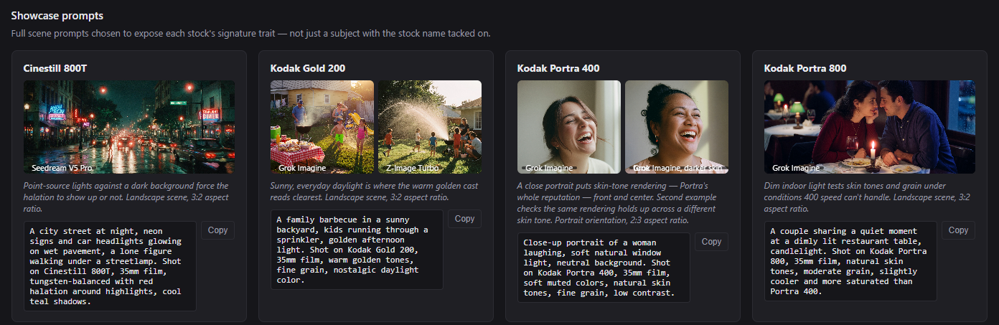

# Film Compare

An HTML tool for comparing photos side-by-side.

## Usage

Open `index.html` directly in a browser — no server, no build step, no external dependencies. Works fully offline via `file://`.

1. **Choose Folder** loads every image in a folder. If it has subfolders, check **Include subfolders** first (in the header) to pull images from them too — otherwise only top-level images load.
2. Each image appears as a card with an editable label (defaults to filename) and a **★** button to mark it the **reference** image — the reference pins to the front of the grid and gets a highlighted border.
3. Click any thumbnail to enter **compare mode**.

## Compare mode

- Two-plus-panel layout: the **reference stays locked** on the left; the **Compare: 1/2/3** dropdown in the header controls how many other images sit alongside it.
- Drag to pan, scroll to zoom — pan/zoom is synced across all visible panels so you can hold the same crop (e.g. to check grain) while flipping between stocks.
- **Prev/Next buttons, the slider, or ←/→ arrow keys** step the visible window through the non-reference images.
- **Click any non-reference slot** to open a picker modal and manually assign a specific image to that slot. A pinned slot shows a 📌 badge; click the badge to release it. **Pinned slots are skipped by Prev/Next/the slider** — stepping only cycles the remaining unpinned slots, so you can lock a couple of images in place and still step through the rest.
- Esc closes compare mode (or the picker modal, if that's open).

## Help

The **Help** link in the header opens `help.html`, a standalone film stock reference page — useful even outside this app, e.g. when prompting a model elsewhere and you want stock-accurate wording. It has:

- A **reference table** of common stocks: type/ISO, signature look, best-for use case, and a ready-to-copy short prompt
- **Showcase prompts** — one full scene per stock, each chosen to expose that stock's defining trait (e.g. a neon night scene for Cinestill 800T's halation, a complementary orange/green landscape for Velvia 50's saturation) — with real example images generated from each prompt
- A **T2I / I2I prompt template** note, and **model notes** on how different image models handle film-stock prompting, including hands-on findings where a model's output diverged from what was expected

## Files

- `index.html` — the main app (HTML/CSS/JS)
- `help.html` — film stock reference page, linked from the header. See [Help](#help) above.
- `examples/` — example generated images referenced by `help.html`'s showcase cards and model notes.

## Notes

- No persistence — reloading the page clears everything; it's meant for one comparison session at a time.
- Nothing is uploaded anywhere — images are read locally via the browser's File System APIs and never leave the page.
